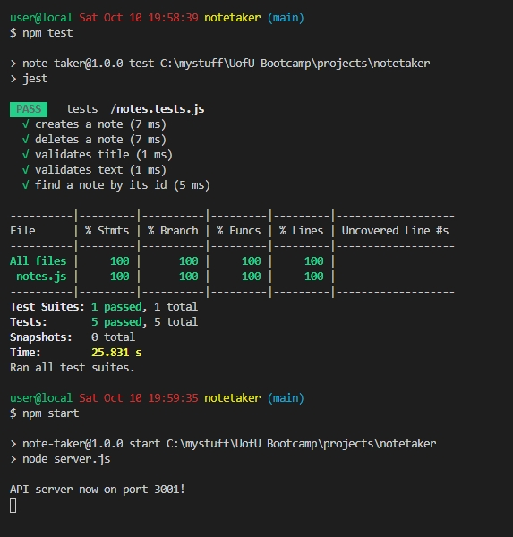
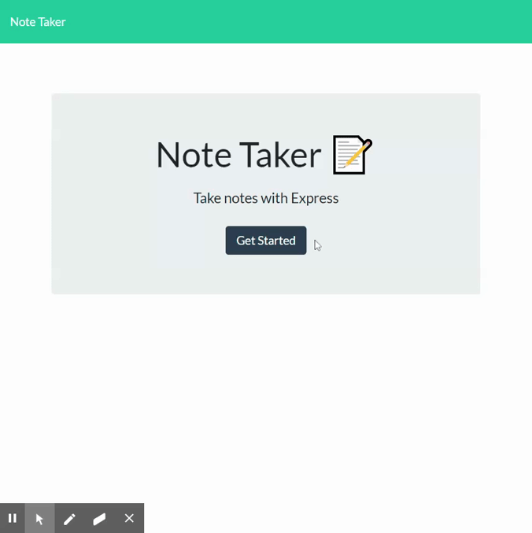

# Note Taker

## Description 
A Web-based application that can add, view, and delete notes for a user. This application is deployed to Heroku cloud platform and uses NodeJS with ExpressJS and Unique ID Key NPM modules on the backend. Notes are stores in a JSON file.

## Table of Contents
* [Installation](#installation)
* [Usage](#usage)
* [License](#license)
* [Contributing](#contributing)
* [Tests](#tests)
* [Questions](#questions)
* [Screenshots](#screenshots)

## Installation
Install the application using "npm install."

## Usage 
This application will store, retrieve, and delete notes using a Web-based interface. Start the application with the command "npm start."

## License
This project uses The MIT License.

## Contributing
Feel free to contact me over email if you have some great ideas.

## Tests
Test using "npm test" and manually through the Web-based interface. Code coverage is 100%.

## Questions
Feel free to contact the developer at jesse@parent.com about contributing to https://github.com/jesseparent

## Screenshots
The user running tests and starting the application from the console:

The user using the Web-based interface to create, read, and delete notes:
